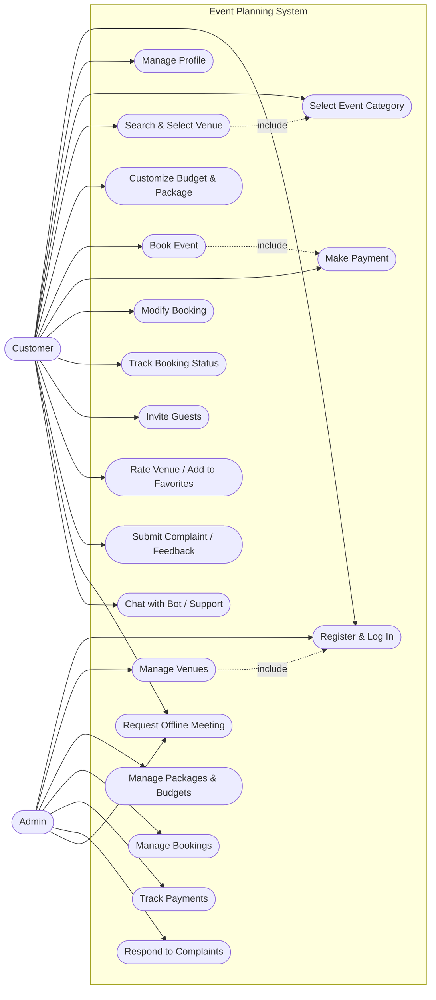

```mermaid
flowchart LR
    %% Actors
    C([Customer])
    A([Admin])

    %% Event Planning System
    subgraph EPS[Event Planning System]
        %% Account Management
        UC1([Register & Log In])
        UC2([Manage Profile])

        %% Event Planning & Booking
        UC3([Select Event Category])
        UC4([Search & Select Venue])
        UC5([Customize Budget & Package])
        UC6([Book Event])
        UC7([Make Payment])
        UC8([Modify Booking])
        UC9([Track Booking Status])

        %% Social & Communication
        UC10([Invite Guests])
        UC11([Rate Venue / Add to Favorites])
        UC12([Submit Complaint / Feedback])
        UC13([Request Offline Meeting])
        UC14([Chat with Bot / Support])

        %% Admin Functions
        UC15([Manage Venues])
        UC16([Manage Packages & Budgets])
        UC17([Manage Bookings])
        UC18([Track Payments])
        UC19([Respond to Complaints])
    end

    %% Customer Relationships
    C --> UC1
    C --> UC2
    C --> UC3
    C --> UC4
    C --> UC5
    C --> UC6
    C --> UC7
    C --> UC8
    C --> UC9
    C --> UC10
    C --> UC11
    C --> UC12
    C --> UC13
    C --> UC14

    %% Admin Relationships
    A --> UC1
    A --> UC15
    A --> UC16
    A --> UC17
    A --> UC18
    A --> UC19
    A --> UC13

    %% Relationships between Use Cases (Includes/Extends)
    UC6 -.->|include| UC7
    UC4 -.->|include| UC3
    UC15 -.->|include| UC1
```